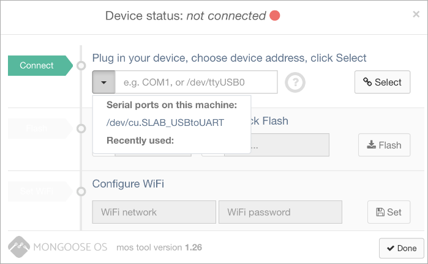
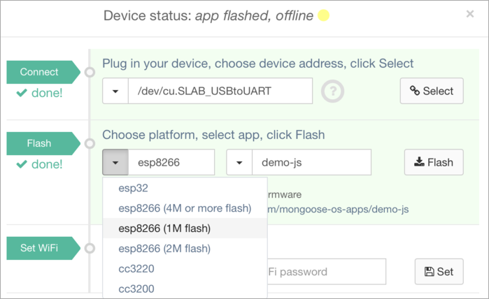

Mongoose OS asennus iMac
-------------------------

* 2018-03-03 esa.laitila@netmiller.fi
* MacOS Sierra (v.10.12.6)

Asennettu __MongooseOS kehitysympäristö__ koneelle (ESP8266 ja ESP32 kehitykseen).

<https://mongoose-os.com>

----

Testattu tämmöisellä laitteella 

* ESP8266 NodeMcu
* hinta __EUR 2.86__  (eBay:ssä)


----

__Asennus :__

````
► iMac@~$ curl -fsSL https://mongoose-os.com/downloads/mos/install.sh | /bin/bash

Installing libftdi1.2.dylib ...
Downloading https://mongoose-os.com/downloads/mos-release/mac/mos ...
######################################################################## 100.0%
Installing into /Users/esa/.mos/bin/mos ...
Adding /Users/esa/.mos/bin to your PATH in /Users/esa/.bashrc
SUCCESS: /Users/esa/.mos/bin/mos is installed.
Run '/Users/esa/.mos/bin/mos --help' to see all available commands.
Run '/Users/esa/.mos/bin/mos' without arguments to start a simplified Web UI installer.

► iMac@~$

````

Ohjelma toimii ja UI käynnistyy komennolla :

````
► iMac@~$ .mos/bin/mos ui
````

mutta laitetta ei löydy, joten tarvitaan ilmeisesti lisää ajureita .

----

__Ajureiden asennus__

__ESP8266__ pohjassa lukee että pitää asentaa __CP2102 driver__, joka näyttäisi löytyvän osoitteesta :

<https://www.silabs.com/documents/public/software/Mac_OSX_VCP_Driver.zip>

joten kokeillaan sitä -> linkistä latautuu tiedosto __Mac_OSX_VCP_Driver.zip__

````
► iMac@~$ unzip -l Desktop/Mac_OSX_VCP_Driver.zip

Archive:  Desktop/Mac_OSX_VCP_Driver.zip
  Length      Date    Time    Name
---------  ---------- -----   ----
   283245  01-23-2018 11:40   SiLabsUSBDriverDisk.dmg
---------                     -------
   283245                     1 file

````

----

Täytyy yrittää purkaa ja asentaa tuo .dmg image.

DMG-paketista löytyy myös :

* [ReleaseNotes.txt](ReleaseNotes.txt)
* [Uninstaller](uninstaller.sh)

__OK, ajureiden asennus auttoi__

Nyt ainakin saa yhteyden laitteeseen, mutta perus-flash-toimet vielä puuttuu :




----

Kokeiltu vielä tehdä joku __testi-flash__ että nähdään toimiiko lainkaan :

* valittu Platform:ksi __esp8266 (1M flash)__
* tämä ihan kokeiluna kun ei tietoa mikä on oikea flash-määrä tällä laitteella
* luultavasti tässä on kuitenkin __4M flash__ !
* testataan __demo-js__ applikaatiolla ( vilkuttelee lediä yms ?? )



Ja painettu __Flash__ toimintoa.

* aluksi ei oikein tapahtunut mitään
* sitten laite irti USB-kaapelista ja takaisin kiinni
* uusi __Connect__ ja __Flash__ niin jo lähti toimimaan
* nyt flash antaa seuraavia ilmoituksia, ja sen jälkeen alkaa tekemään mitä tuo __demo-js__ käskee :

````

[Mar  3 13:16:22.472] E0303 13:16:22.472636   16068 ui.go:537] Calling: Config.Get
Loaded https://mongoose-os.com/downloads/api.json
[Mar  3 13:16:27.312] E0303 13:16:27.312169   16068 ui.go:561] Call complete, error: write /dev/cu.SLAB_USBtoUART: file already closed
[Mar  3 13:16:28.818] Fetching https://github.com/mongoose-os-apps/demo-js/releases/download/1.26/demo-js-esp8266.zip...
[Mar  3 13:16:31.575] Loaded demo-js/esp8266 version 1.0 (20180208-165950/???)
[Mar  3 13:16:31.576] Opening /dev/cu.SLAB_USBtoUART @ 115200...
Server Error: {"error":"Device is not connected"}
Server Error: {"error":"open /dev/cu.SLAB_USBtoUART: no such file or directory"}
[Mar  3 13:16:56.194] E0303 13:16:56.194273   16068 ui.go:537] Calling: Sys.GetInfo
"""[Mar  3 13:16:59.195] E0303 13:16:59.195444   16068 ui.go:561] Call complete, error: context deadline exceeded
[Mar  3 13:17:09.545] Fetching https://github.com/mongoose-os-apps/demo-js/releases/download/1.26/demo-js-esp8266-1M.zip...
[Mar  3 13:17:11.600] Loaded demo-js/esp8266 version 1.0 (20180208-170005/???)
[Mar  3 13:17:11.600] Opening /dev/cu.SLAB_USBtoUART @ 115200...
[Mar  3 13:17:11.713] Connecting to ESP8266 ROM, attempt 1 of 10...
[Mar  3 13:17:12.193]   Connected, chip: ESP8266EX
[Mar  3 13:17:12.193] Running flasher @ 460800...
[Mar  3 13:17:13.674]   Flasher is running
[Mar  3 13:17:13.709] Flash size: 4194304, params: 0x0240 (dio,32m,40m)
[Mar  3 13:17:13.710] Deduping...
[Mar  3 13:17:14.531]      4096 @ 0xfb000 -> 0
[Mar  3 13:17:14.567] Writing...
[Mar  3 13:17:14.567]      4096 @ 0x0
[Mar  3 13:17:14.658]      4096 @ 0x7000
[Mar  3 13:17:14.743]    782336 @ 0x8000
[Mar  3 13:17:27.434]    131072 @ 0xdb000
[Mar  3 13:17:28.868]      4096 @ 0x3fc000
[Mar  3 13:17:28.933] Wrote 916560 bytes in 14.37 seconds (498.44 KBit/sec)
[Mar  3 13:17:28.933] Verifying...
[Mar  3 13:17:28.933]      2736 @ 0x0
[Mar  3 13:17:28.969]      4096 @ 0x7000
[Mar  3 13:17:29.007]    778528 @ 0x8000
[Mar  3 13:17:29.378]    131072 @ 0xdb000
[Mar  3 13:17:29.472]      4096 @ 0xfb000
[Mar  3 13:17:29.510]       128 @ 0x3fc000
[Mar  3 13:17:29.547] Booting firmware...
[Mar  3 13:17:29.724] All done!
bcn 0
[Mar  3 13:17:31.155] del if1
[Mar  3 13:17:31.155] usl
[Mar  3 13:17:31.156] add if1
[Mar  3 13:17:31.156] dhcp server start:(ip:192.168.4.1,mask:255.255.255.0,gw:192.168.4.1)
[Mar  3 13:17:31.162] bcn 100
[Mar  3 13:17:31.163] mgos_wifi_dev_ap_set WiFi AP IP: 192.168.4.1/255.255.255.0 gw 192.168.4.1, DHCP range 192.168.4.2 - 192.168.4.100
[Mar  3 13:17:31.175] mgos_http_server_ini HTTP server started on [80]
[Mar  3 13:17:31.181] mgos_ota_http_client Init done, ota_lib=(null), ota handler 1
[Mar  3 13:17:31.189] mg_rpc_channel_uart  0x3fff170c UART0
[Mar  3 13:17:31.195] mgos_init            Init done, RAM: 52008 total, 41616 free, 41624 min free
[Mar  3 13:17:32.185] LED GPIO: 2 button GPIO: 0 
[Mar  3 13:17:32.209] mgos_aws_shadow_init AWS Device Shadow requires MQTT
[Mar  3 13:17:32.225] mongoose_poll        New heap free LWM: 28000
[Mar  3 13:17:32.827] E0303 13:17:32.827884   16068 ui.go:537] Calling: Sys.GetInfo
[Mar  3 13:17:33.122] E0303 13:17:33.122810   16068 ui.go:563] Call complete, success
[Mar  3 13:17:33.128] E0303 13:17:33.128953   16068 ui.go:537] Calling: Config.Get
[Mar  3 13:17:33.222] Tick uptime: 3.050746 {"free_ram":35388,"total_ram":52008} 
[Mar  3 13:17:33.867] E0303 13:17:33.867860   16068 ui.go:563] Call complete, success
[Mar  3 13:17:34.215] Tock uptime: 4.048773 {"free_ram":35248,"total_ram":52008} 
[Mar  3 13:17:35.215] Tick uptime: 5.049312 {"free_ram":35248,"total_ram":52008} 
[Mar  3 13:17:36.214] Tock uptime: 6.048640 {"free_ram":35248,"total_ram":52008} 
[Mar  3 13:17:37.215] Tick uptime: 7.049276 {"free_ram":35248,"total_ram":52008} 
[Mar  3 13:17:38.215] Tock uptime: 8.049614 {"free_ram":35248,"total_ram":52008} 
[Mar  3 13:17:39.214] Tick uptime: 9.048955 {"free_ram":35248,"total_ram":52008} 
[Mar  3 13:17:40.215] Tock uptime: 10.049274 {"free_ram":35248,"total_ram":52008} 
[Mar  3 13:17:41.214] Tick uptime: 11.048937 {"free_ram":35248,"total_ram":52008} 
[Mar  3 13:17:42.215] Tock uptime: 12.049346 {"free_ram":35248,"total_ram":52008} 
[Mar  3 13:17:43.214] Tick uptime: 13.048795 {"free_ram":35248,"total_ram":52008} 
[Mar  3 13:17:44.215] Tock uptime: 14.049633 {"free_ram":35248,"total_ram":52008} 
[Mar  3 13:17:45.215] Tick uptime: 15.049933 {"free_ram":35248,"total_ram":52008} 
[Mar  3 13:17:46.215] Tock uptime: 16.049304 {"free_ram":35248,"total_ram":52008} 
[Mar  3 13:17:47.214] Tick

````

----

Vaikuttaa toimivan, ja vilkuttaa lediä vaikka irrottaa laitteen ja kytkee uudelleen ilman että 
tekee IDE:n kautta Connect-toimintoa.  

Joten __flash__ on toiminut ja laite toimii nyt itsenäisesti ?!

----

IDE:stä löytyy laitteen __DeviceConfig__ toiminto, joka näyttää seuraavaa __(ExpertView)__ :

````
{
  "update": {
    "timeout": 300,
    "commit_timeout": 0,
    "url": "",
    "interval": 0,
    "ssl_ca_file": "ca.pem",
    "ssl_client_cert_file": "",
    "ssl_server_name": "",
    "enable_post": true
  },
  "device": {
    "id": "esp8266_1196E3",
    "password": ""
  },
  "debug": {
    "udp_log_addr": "",
    "mbedtls_level": 0,
    "level": 2,
    "filter": "",
    "stdout_uart": 0,
    "stderr_uart": 0,
    "factory_reset_gpio": -1,
    "mg_mgr_hexdump_file": "",
    "stdout_topic": "",
    "stderr_topic": ""
  },
  "sys": {
    "mount": {
      "path": "",
      "dev_type": "",
      "dev_opts": "",
      "fs_type": "",
      "fs_opts": ""
    },
    "tz_spec": "",
    "wdt_timeout": 30,
    "pref_ota_lib": "",
    "atca": {
      "enable": false,
      "i2c_addr": 96,
      "ecdh_slots_mask": 12
    }
  },
  "conf_acl": "*",
  "i2c": {
    "enable": true,
    "freq": 100000,
    "debug": false,
    "sda_gpio": 12,
    "scl_gpio": 14
  },
  "mqtt": {
    "enable": false,
    "server": "iot.eclipse.org:1883",
    "client_id": "",
    "user": "",
    "pass": "",
    "reconnect_timeout_min": 2,
    "reconnect_timeout_max": 60,
    "ssl_cert": "",
    "ssl_key": "",
    "ssl_ca_cert": "",
    "ssl_cipher_suites": "",
    "ssl_psk_identity": "",
    "ssl_psk_key": "",
    "clean_session": true,
    "keep_alive": 60,
    "will_topic": "",
    "will_message": "",
    "max_qos": 2,
    "recv_mbuf_limit": 3072
  },
  "shadow": {
    "lib": ""
  },
  "aws": {
    "thing_name": "esp8266_1196E3",
    "greengrass": {
      "enable": false,
      "reconnect_timeout_min": 2,
      "reconnect_timeout_max": 60
    }
  },
  "wifi": {
    "sta": {
      "enable": false,
      "ssid": "",
      "pass": "",
      "user": "",
      "anon_identity": "",
      "cert": "",
      "key": "",
      "ca_cert": "",
      "ip": "",
      "netmask": "",
      "gw": "",
      "nameserver": "",
      "dhcp_hostname": ""
    },
    "ap": {
      "enable": true,
      "ssid": "Mongoose_??????",
      "pass": "Mongoose",
      "hidden": false,
      "channel": 6,
      "max_connections": 10,
      "ip": "192.168.4.1",
      "netmask": "255.255.255.0",
      "gw": "192.168.4.1",
      "dhcp_start": "192.168.4.2",
      "dhcp_end": "192.168.4.100",
      "trigger_on_gpio": -1,
      "disable_after": 0,
      "hostname": "",
      "keep_enabled": true
    }
  },
  "http": {
    "enable": true,
    "listen_addr": "80",
    "document_root": "/",
    "ssl_cert": "",
    "ssl_key": "",
    "ssl_ca_cert": "",
    "upload_acl": "*",
    "hidden_files": "",
    "auth_domain": "",
    "auth_file": ""
  },
  "rpc": {
    "enable": true,
    "max_frame_size": 4096,
    "max_queue_length": 25,
    "default_out_channel_idle_close_timeout": 10,
    "acl_file": "",
    "auth_domain": "",
    "auth_file": "",
    "ws": {
      "enable": true,
      "server_address": "",
      "reconnect_interval_min": 1,
      "reconnect_interval_max": 60,
      "ssl_server_name": "",
      "ssl_ca_file": "",
      "ssl_client_cert_file": ""
    },
    "mqtt": {
      "enable": true,
      "topic": ""
    },
    "uart": {
      "uart_no": 0,
      "baud_rate": 115200,
      "fc_type": 2,
      "wait_for_start_frame": true
    }
  },
  "dash": {
    "enable": false,
    "token": "",
    "server": "wss://dash.mongoose-os.com/api/v1/rpc",
    "ca_file": "ca.pem",
    "send_logs": true,
    "stats_interval": 10,
    "ota_chunk_size": 1024
  },
  "dns_sd": {
    "enable": false,
    "host_name": "mOS_esp8266_??????",
    "txt": "",
    "ttl": 120
  },
  "gcp": {
    "enable": false,
    "project": "",
    "region": "",
    "registry": "",
    "device": "",
    "key": "",
    "token_ttl": 3600
  },
  "sntp": {
    "enable": true,
    "server": "time.google.com",
    "retry_min": 1,
    "retry_max": 30,
    "update_interval": 7200
  },
  "spi": {
    "enable": false,
    "debug": false,
    "miso_gpio": 12,
    "mosi_gpio": 13,
    "sclk_gpio": 14,
    "cs0_gpio": 15,
    "cs1_gpio": -1,
    "cs2_gpio": -1
  },
  "pins": {
    "led": 2,
    "button": 0
  },
  "mjs": {
    "generate_jsc": true
  }
}

````

Ja sitten yhdistetään laite __WiFi-verkkoon__ :


__Set__ komento antaa seuraavanlaista ilmoitusta :

````
[Mar  3 13:50:45.544] mgos_wifi_setup      WiFi mode: STA
[Mar  3 13:50:45.548] mgos_wifi_set_mode   WiFi mode: STA
[Mar  3 13:50:45.551] mode : sta(dc:4f:22:11:96:e3)
[Mar  3 13:50:45.554] add if0
[Mar  3 13:50:45.555] WPA2 ENTERPRISE VERSION: [v2.0] disable
[Mar  3 13:50:45.558] mgos_wifi_setup_sta  WiFi STA: Connecting to HUAWEI-E5186-0F46
[Mar  3 13:50:45.566] mgos_http_server_ini HTTP server started on [80]
[Mar  3 13:50:45.572] mgos_ota_http_client Init done, ota_lib=(null), ota handler 1
[Mar  3 13:50:45.580] mg_rpc_channel_uart  0x3fff0f74 UART0
[Mar  3 13:50:45.586] mgos_init            Init done, RAM: 52008 total, 42868 free, 42048 min free
[Mar  3 13:50:46.406] LED GPIO: 2 button GPIO: 0 
[Mar  3 13:50:46.431] mgos_aws_shadow_init AWS Device Shadow requires MQTT
[Mar  3 13:50:46.445] mongoose_poll        New heap free LWM: 30120
[Mar  3 13:50:46.450] mgos_net_on_change_c WiFi STA: connecting
[Mar  3 13:50:46.467] == Net event: 1313166337 CONNECTING 
[Mar  3 13:50:49.183] scandone
[Mar  3 13:50:50.067] state: 0 -> 2 (b0)
[Mar  3 13:50:50.099] state: 2 -> 3 (0)
[Mar  3 13:50:50.103] state: 3 -> 5 (10)
[Mar  3 13:50:50.105] add 0
[Mar  3 13:50:50.106] aid 5
[Mar  3 13:50:50.106] cnt 
[Mar  3 13:50:50.118] 
[Mar  3 13:50:50.119] connected with HUAWEI-E5186-0F46, channel 5
[Mar  3 13:50:50.123] dhcp client start...
[Mar  3 13:50:50.124] mgos_net_on_change_c WiFi STA: connected
[Mar  3 13:50:50.141] == Net event: 1313166338 CONNECTED 
[Mar  3 13:50:54.043] ip:192.168.0.156,mask:255.255.255.0,gw:192.168.0.88
[Mar  3 13:50:54.048] mgos_net_on_change_c WiFi STA: ready, IP 192.168.0.156, GW 192.168.0.88, DNS 192.168.0.88
[Mar  3 13:50:54.070] == Net event: 1313166339 GOT_IP 
[Mar  3 13:50:55.135] mgos_sntp_query      SNTP query to time.google.com
[Mar  3 13:50:55.268] mgos_sntp_ev         SNTP reply from 216.239.35.8: time 1520077856.214171, local 9.984751, delta 1520077846.229420
[Mar  3 13:50:55.375] E0303 13:50:55.375725   16152 ui.go:537] Calling: FS.ListExt
[Mar  3 13:50:55.899] E0303 13:50:55.899458   16152 ui.go:563] Call complete, success
[Mar  3 13:50:56.166] mgos_fs_get_handler  Sending init.js
[Mar  3 13:50:56.274] E0303 13:50:56.274803   16152 ui.go:537] Calling: Sys.GetInfo
Loaded init.js
[Mar  3 13:50:57.243] E0303 13:50:57.243407   16152 ui.go:563] Call complete, success
[Mar  3 13:50:57.250] E0303 13:50:57.250947   16152 ui.go:537] Calling: Config.Get
[Mar  3 13:50:58.006] E0303 13:50:58.006477   16152 ui.go:563] Call complete, success
[Mar  3 13:51:00.104] pm open,type:2 0

````

Laite vastaa nyt ainakin __ping__ komentoon:

````
► iMac@server$ ping 192.168.0.156
PING 192.168.0.156 (192.168.0.156): 56 data bytes
64 bytes from 192.168.0.156: icmp_seq=0 ttl=128 time=70.250 ms
64 bytes from 192.168.0.156: icmp_seq=1 ttl=128 time=89.022 ms
64 bytes from 192.168.0.156: icmp_seq=2 ttl=128 time=110.859 ms
64 bytes from 192.168.0.156: icmp_seq=3 ttl=128 time=2.031 ms
64 bytes from 192.168.0.156: icmp_seq=4 ttl=128 time=2.428 ms
64 bytes from 192.168.0.156: icmp_seq=5 ttl=128 time=2.001 ms
````

----

Laitteen __config__ näyttää nyt seuraavaa :


eli se on löytänyt itselleen IP-osoitteen __192.168.0.156__ 

____

Ja vastaa myös selaimelle (ainakin __index__ näkymä tulee oletuksena)


----

__Jätetään kokeilut toistaiseksi tähän ja jatketaan myöhemmin.__

Myös __ESP32__ laite on tilattu joten sillä voidaan myös testata.

----

